# Complaint Management System

## Setup Instructions

1. **Clone the Repository**  
   ```bash
   git clone https://github.com/tarunkumar2005/complaint-board
   cd complaint-board
   ```

2. **Install Dependencies**  
   Ensure you have Node.js and npm installed. Then run:  
   ```bash
   npm install or bun install
   ```

3. **Configure Environment Variables**  
   Create a `.env` file in the root directory and add the variables from `.env.example`.

4. **Run the Application**  
   ```bash
   npm run dev or bun run dev
   ```

5. **Access the Application**  
   Open your browser and navigate to `http://localhost:3000`.

## Features

- User Authentication (Sign Up, Login, Logout)
- Submit and View Complaints
- Admin Dashboard for Managing Complaints
- Separate User and Admin Interfaces

## Technologies Used
- Next.js
- TypeScript
- Tailwind CSS 4.0
- Shadcn UI
- MongoDB with Mongoose
- JWT for Authentication

## How to use

1. Go to the / page to submit a complaint. Before submitting, you need to sign up or log in.

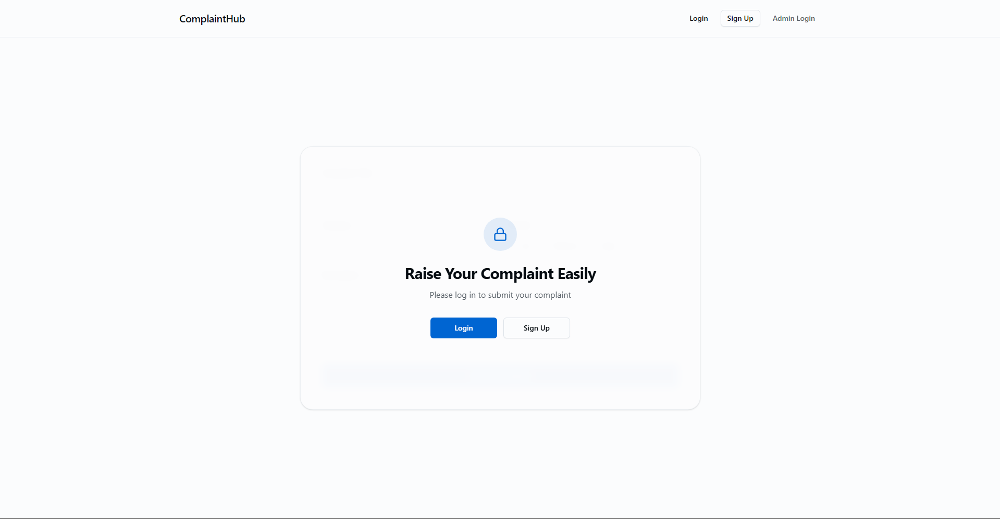

2. Click on the "Login" or "Sign Up" button in the navigation bar to login or create a new account.

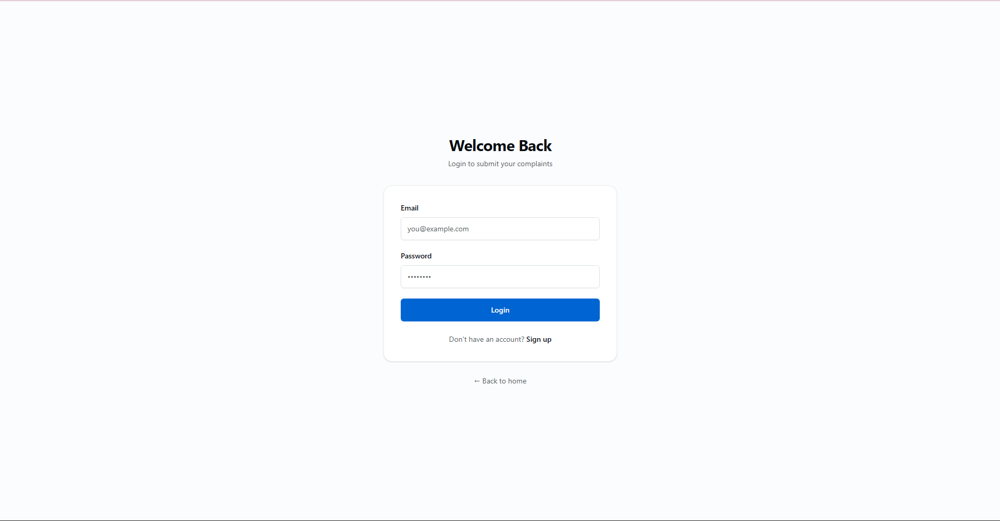

Dummy user credentials for testing:
   - Email: hello@gmail.com
   - Password: Hello@625

3. After logging in, you will be redirected to the home page where you can submit your complaint.


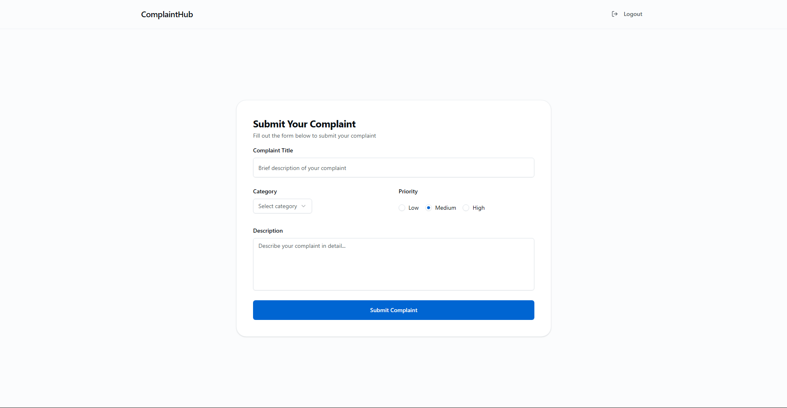

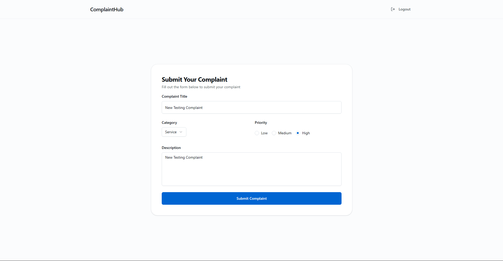

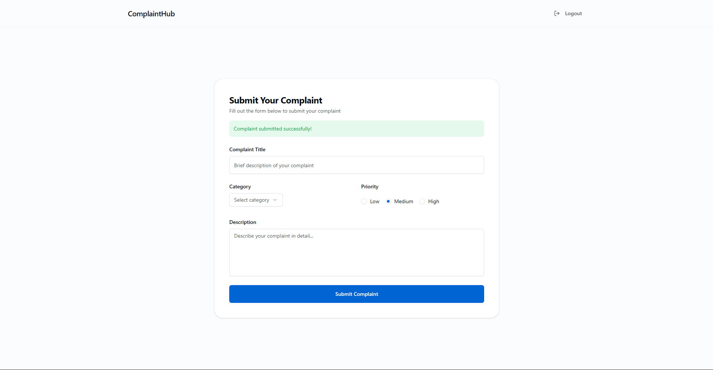

(Logout from user account to login as admin)

4. To view the complaints, navigate to the /admin page. Only admin users can access this page.

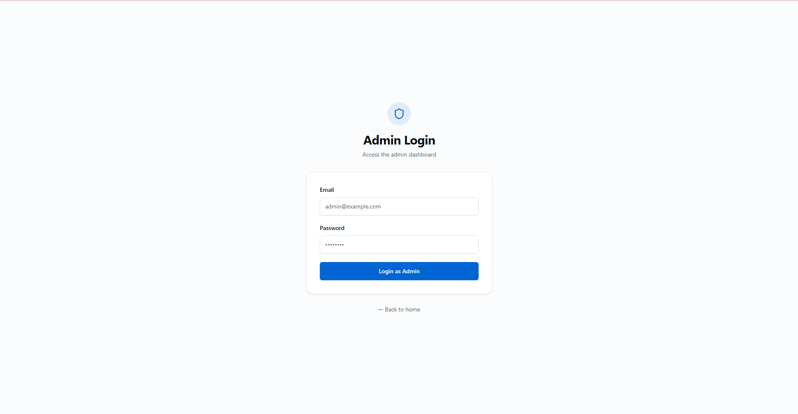

5. Logout by clicking the "Logout" button in the navigation bar. Then click on "Admin Login" to log in as an admin user.

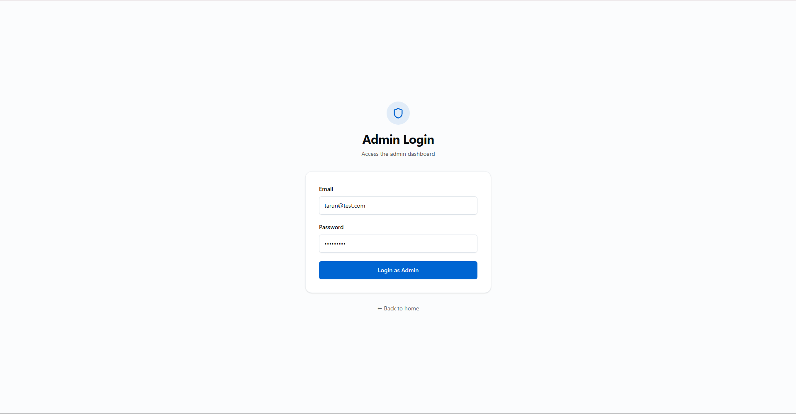

6. Use the dummy admin credentials:
   - Email: tarun@test.com
   - Password: Hello@625

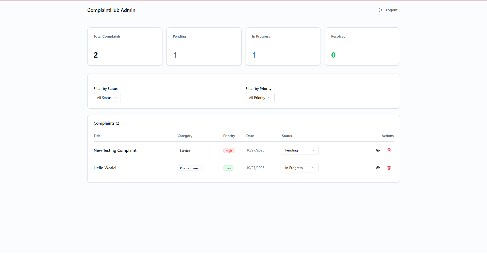

7. After logging in as an admin, you can view all complaints and manage them.


8. Click on the status dropdown to change the status of a complaint.

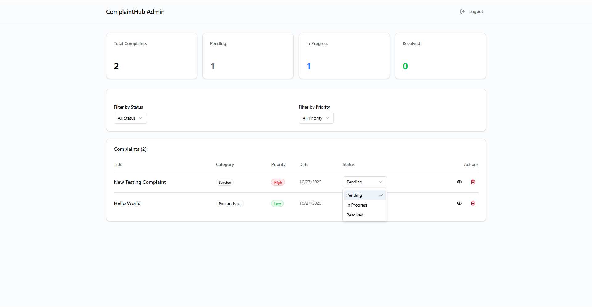

9. To view complaint details, click on the eye icon in the actions column.
10. To delete a complaint, click on the trash icon in the actions column.
11. Everytime a new complaint is submitted, an email notification is sent to the admin email (All admins in the database).

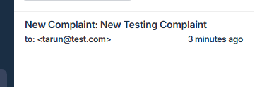

12. Everytime a complaint status is updated, an email notification is sent to the user who submitted the complaint.

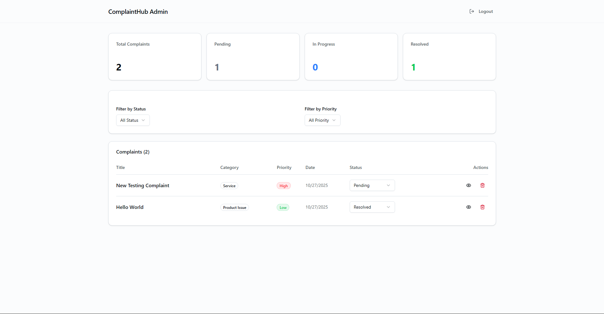

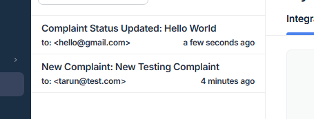

## Setting up the SMTP Server for Email Notifications

1. Sign up on [Mailtrap](https://mailtrap.io/) to create a free account.
2. Go to the Sandbox section and find your SMTP credentials.
3. In your `.env` file, add the following variables with your Mailtrap credentials:
   ```
   SMTP_HOST=smtp.mailtrap.io
   SMTP_PORT=2525
   SMTP_USER=your_mailtrap_username
   SMTP_PASS=your_mailtrap_password
   ```
4. Save the `.env` file and restart your development server.
5. You can see the new emails in the Mailtrap inbox whenever a complaint is submitted or its status is updated.

## Setting up the MongoDB Database

1. Sign up on [MongoDB Atlas](https://www.mongodb.com/cloud/atlas) to create a free account.
2. Create a new project and a new free cluster in that project.
3. It'll prompt you to create a database user. Create a username and password for the database user.
4. It'll also show you the connection string. Copy the connection string and replace username and password with the database user credentials you just created, if required.
5. In your `.env` file, add the following variable with your connection string:
   ```
   MONGODB_URI=your_mongodb_connection_string
   ```
6. Save the `.env` file and restart your development server.
7. Your application should now be connected to the MongoDB database.

Note: I didn't utilize the git commit history or PRs because this is a small project and it would be unnecessary overhead. Visit the other repositories for examples of using git effectively.

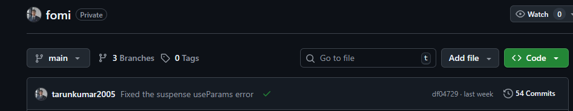

This is an example of how I use git effectively in my other projects. The Repo Shown is private but you can see the commits and Branches in the image.